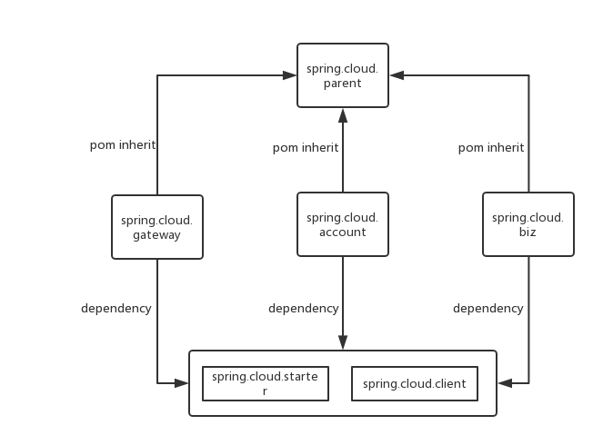
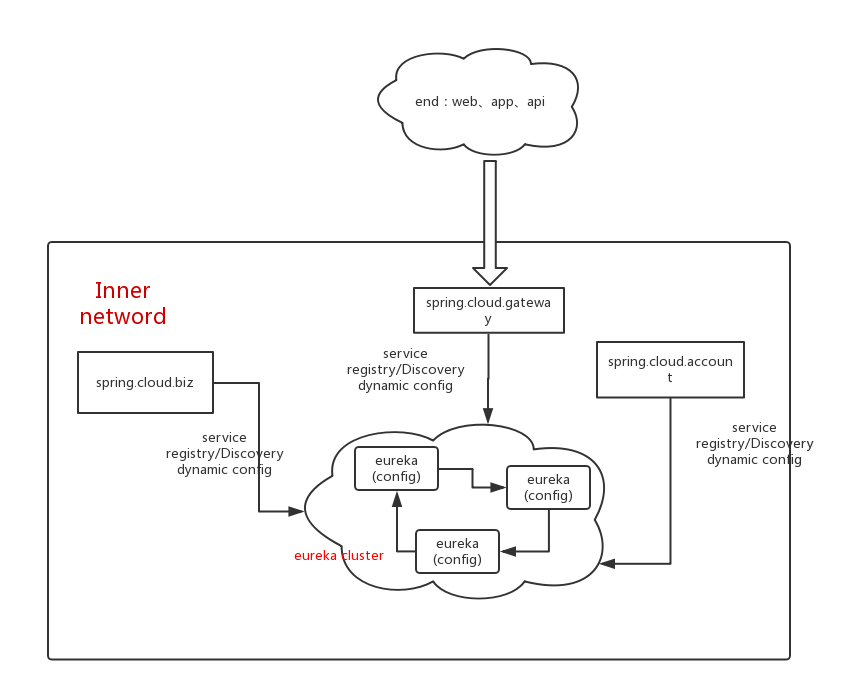

# Introduction

1. This project is a demo project for spring cloud microservice structure, using spring-boot, including: 
	- spring cloud eureka
	- spring cloud config
	- ribbon
	- feign
	- hystrix
	- turbine
	- Spring Cloud Starters
	- multi databases with dynamic select（AOP）
	- Global traceId
	- velocity
	- mybatis, pageHelper (for paging), druid (alibaba druid, for mysql dataSource and connection pool)
	- redis (jdk serialization)
	- slf4j & logback
	- Internationality
	- Global Exception catch
	- Task executor thread pool
	- HealthCheck, globalHealthCheck

2. This project has a login page. After login, you can see the first page of momentList, add new moments to the list, see the comments of each moment, and add new comments to the comment list. 

# Run

1. first of all, you should get a redis started, and a mysql started. Then, the sql for creating databases and dbs is as below:

```
create database test;

CREATE TABLE `account` (
  `user_id` varchar(127) NOT NULL DEFAULT '',
  `user_name` varchar(127) NOT NULL DEFAULT '',
  `password` varchar(127) NOT NULL DEFAULT '',
  `gmt_created` datetime NOT NULL,
  `gmt_modified` datetime DEFAULT NULL,
  `is_deleted` tinyint(1) NOT NULL DEFAULT '0',
  PRIMARY KEY (`user_id`),
  KEY `index_user_id` (`user_id`) KEY_BLOCK_SIZE=10
) ENGINE=InnoDB DEFAULT CHARSET=utf8mb4;

CREATE TABLE `moment` (
  `id` bigint(20) unsigned NOT NULL AUTO_INCREMENT,
  `user_id` varchar(127) COLLATE utf8mb4_unicode_ci NOT NULL,
  `content` text COLLATE utf8mb4_unicode_ci,
  `gmt_created` datetime NOT NULL,
  `gmt_modified` datetime DEFAULT NULL,
  `is_deleted` tinyint(1) DEFAULT '0',
  PRIMARY KEY (`id`),
  KEY `index_user_id` (`user_id`)
) ENGINE=InnoDB AUTO_INCREMENT=8 DEFAULT CHARSET=utf8mb4 COLLATE=utf8mb4_unicode_ci;

create database test2;

CREATE TABLE `comment` (
  `id` bigint(20) unsigned NOT NULL AUTO_INCREMENT,
  `moment_id` bigint(20) unsigned NOT NULL,
  `content` text COLLATE utf8mb4_unicode_ci,
  `gmt_created` datetime NOT NULL,
  `gmt_modified` datetime DEFAULT NULL,
  `is_deleted` tinyint(1) DEFAULT '0',
  PRIMARY KEY (`id`),
  KEY `index_moment_id` (`moment_id`)
) ENGINE=InnoDB AUTO_INCREMENT=5 DEFAULT CHARSET=utf8mb4 COLLATE=utf8mb4_unicode_ci;
```

2. Java 8 and maven 3 are required.
3. run command in order:

```
	cd spring-cloud-parent
	mvn clean install -DskipTests
	cd ../spring-cloud-client
	mvn clean install -DskipTests
	cd ../spring-cloud-starter
	mvn clean install -DskipTests
	
	cd spring-cloud-eureka
	mvn clean spring-boot:run
	
	cd spring-cloud-account
	mvn clean spring-boot:run
	
	cd spring-cloud-biz
	mvn clean spring-boot:run	
	
	cd spring-cloud-gateway
	mvn clean spring-boot:run
```
4. open ```http://127.0.0.1:7001/index``` in brower


# Code explain
1. The dependency of this project is shown below :

2. spring-cloud-parent is just a empty maven project, contains the common poms for other project, so spring-cloud-eureka, spring-cloud-biz, spring-cloud-account and spring-cloud-gateway all inherate from spring-cloud-parent
3. spring-cloud-starter is a demo starter, it cointains the common beans, common bean configurations for spring-cloud-biz, spring-cloud-account and spring-cloud-gateway.
4. spring-cloud-client is a common depency for all, contains some util classes and java Models responding to the db table.
5. spring-cloud-eureka is a server for Service Registration and Service Discovery. Also, I combined spring cloud config with eureka, for dynamic configrations. The heart beat time of eureka is configed to 5s, instead of 15s. 
6. spring-cloud-account is the account module
7. spring-cloud-biz is the real business module, contains the moment module and comment module, and this project uses two dbs dynamicly.
8. spring-cloud-gateway is the gateway for all these modules. All outer requests from apps or web pages, should be sent to gateway. GateWay should veirify the login status, do the uploading, do some filters or other aspects.
9. If you want to stop any of spring-cloud-account, spring-cloud-biz or spring-cloud-gateway, use this command: ```curl -H 'Accept:application/json' -X POST localhost:7004/shutdown```, to stop the heartbeat to the eureka cluster.

# Deploy to the production env
1. These projects should be deployed like this:



中文介绍： http://www.jianshu.com/p/c14c47243994

Any questions, please send to chxfantasy@gmail.com

HomePage: http://www.jianshu.com/u/c031bded621b

wx: hurry_words